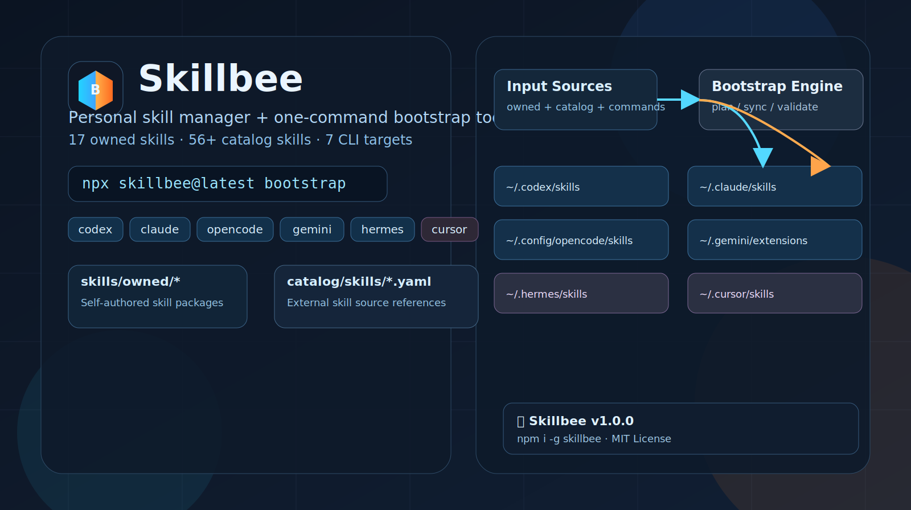

# AImagician Skills

[](./LICENSE)
[](https://nodejs.org/)

<p align="center">
  
</p>

<p align="center">
  
</p>

> Personal skills repository and one-command bootstrap toolkit for Codex / Claude / OpenCode / Gemini / Hermes / Cursor.
>
> 中文：面向多 AI CLI 的个人 skills 仓库与一键部署工具。

默认中文文档。  
English quick doc: [docs/README.en.md](./docs/README.en.md)

这是一个面向多 AI CLI 的个人 skills 仓库与一键部署工具，目标是把技能统一安装到用户级目录，让 Codex / Claude / OpenCode / Gemini / Hermes / Cursor 开箱可用。

快速入口：

- [品牌视觉资产](#品牌视觉资产)
- [快速开始](#快速开始)
- [常用命令](#常用命令)
- [当前-skill-全量清单](#当前-skill-全量清单)
- [当前支持矩阵](#当前支持矩阵)
- [用户级安装路径](#用户级安装路径)
- [验证与排障](#验证与排障)

## 品牌视觉资产

仓库使用专属品牌视觉，已纳入版本管理：

- Logo: `./docs/assets/aimagician-skills-logo.svg`
- README cover: `./docs/assets/readme-cover.svg`

设计目标：

- 一眼看出这是“多 CLI skills 分发 + 一键安装”仓库
- 视觉元素直接映射仓库结构（owned/catalog/bootstrap/targets）
- 封面默认 full-bleed，适配 GitHub README 顶部展示

## 核心能力

- 管理自有技能：`skills/owned/*`
- 接入第三方技能源：`catalog/skills/*.yaml`
- 支持命令型安装源（如 GSD / UIPro）
- 按目标 CLI 安装到用户目录（默认全目标）
- 支持 Gemini 扩展生成、OpenCode 插件安装
- 支持安装结果检查：`list / inspect / doctor`
- 支持 Windows PowerPoint COM/VBA 自动化 skill（`window-pptx`）

## 快速开始

```bash
npm install
npm run build
npm run bootstrap
```

如果不传 `--target` / `--targets`，默认安装到全部支持目标（包含 OpenCode 与 Hermes）：

- `codex`
- `claude`
- `opencode`
- `gemini`
- `hermes`
- `cursor`

发布后可直接：

```bash
npx aimagician-skills@latest bootstrap
```

默认 targets 等价于：

```bash
node dist/cli/index.js bootstrap --targets codex,claude,opencode,gemini,hermes,cursor
```

## 常用命令

```bash
# 默认全量安装
npm run bootstrap

# 仅安装到 Claude
node dist/cli/index.js bootstrap --target claude

# 指定多个目标
node dist/cli/index.js bootstrap --targets codex,claude,opencode,gemini,hermes,cursor

# 只看计划，不落盘
node dist/cli/index.js bootstrap --dry-run --json

# 检查已安装资产
node dist/cli/index.js list
node dist/cli/index.js inspect --target codex
node dist/cli/index.js doctor
```

## 当前 Skill 全量清单

本仓库当前 skills 由三部分组成：

1. `skills/owned/*`（仓库自带）
2. `catalog/skills/*.yaml`（第三方仓库或命令源）
3. `bootstrap --dry-run --json` 解析后的可安装 skill 列表（按默认 targets 的并集）

### Owned Skills（13）

- `academic-paper-workflow`
- `cloudflare-image-gen`
- `deep-research-system`
- `design-md-brand-router`
- `github-readme-highstar`
- `infinite-research-loop`
- `karpathy-coding-principles`
- `modelscope_imagegen`
- `modelscope_video_ops`
- `multilingual-diversity-loop`
- `parallel-worktree-pr-flow`
- `repo-to-resume`
- `window-pptx`

### Catalog Skill Sources（7）

- `awesome-claude-skills`（`content-research-writer`、`image-enhancer`）
- `claude-official`（Anthropic 官方 skills，源路径 `anthropics/skills`）
- `deep-research-prompt`
- `gsd`（command source）
- `playwright-skill`
- `slavingia-skills`
- `ui-ux-pro-max-skill`（command source）

### Resolved Skills（46, 默认 targets 并集）

- `academic-paper-workflow`
- `algorithmic-art`
- `brand-guidelines`
- `canvas-design`
- `claude-api`
- `cloudflare-image-gen`
- `company-values`
- `content-research-writer`
- `deep-research-prompt`
- `deep-research-system`
- `design-md-brand-router`
- `doc-coauthoring`
- `docx`
- `find-community`
- `first-customers`
- `frontend-design`
- `github-readme-highstar`
- `grow-sustainably`
- `gsd`
- `image-enhancer`
- `infinite-research-loop`
- `internal-comms`
- `karpathy-coding-principles`
- `marketing-plan`
- `mcp-builder`
- `minimalist-review`
- `modelscope_imagegen`
- `modelscope_video_ops`
- `multilingual-diversity-loop`
- `mvp`
- `parallel-worktree-pr-flow`
- `pdf`
- `playwright-skill`
- `pptx`
- `pricing`
- `processize`
- `repo-to-resume`
- `skill-creator`
- `slack-gif-creator`
- `theme-factory`
- `ui-ux-pro-max`
- `validate-idea`
- `web-artifacts-builder`
- `webapp-testing`
- `window-pptx`
- `xlsx`

如需重新生成该清单（防止文档过期）：

```bash
node dist/cli/index.js bootstrap --dry-run --json
```

## 当前支持矩阵

| 能力 | 状态 | 说明 |
|---|---|---|
| Owned skills | supported | 从 `skills/owned/*` 同步 |
| GitHub skill source | supported | 从仓库抓取后安装 |
| Command source | supported | 委托上游安装命令执行 |
| Codex skills | supported | `~/.codex/skills` |
| Claude Code skills | supported | `~/.claude/skills` |
| OpenCode skills | supported | `~/.config/opencode/skills` |
| Gemini extensions | supported | `~/.gemini/extensions` |
| Hermes skills | supported | `~/.hermes/skills` |
| Cursor skills | supported | `~/.cursor/skills` |
| OpenCode plugins | supported | `~/.config/opencode/plugins` |
| Claude plugins | explicit skip | 保持 marketplace/consent 流程 |
| Gemini plugin catalog | explicit skip | 当前仅支持 skill 扩展生成 |

Cursor 说明：

- Cursor 的 `rules` 和 `skills` 不是一回事。
- 本仓库安装的是 Cursor skills（`~/.cursor/skills`），不是 `.cursor/rules`。

## 目录结构

```text
skills/
  owned/
    <skill-id>/
      SKILL.md
catalog/
  skills/
    *.yaml
  plugins/
    *.yaml
docs/
  CATALOG-CONFIG.md
  GSD-WORKFLOW.md
  DOC-STYLE.md
  README.en.md
```

## 配置说明入口

YAML 配置详解：

- [docs/CATALOG-CONFIG.md](./docs/CATALOG-CONFIG.md)

GSD 工作流说明：

- [docs/GSD-WORKFLOW.md](./docs/GSD-WORKFLOW.md)

中英文文档高级样式规范：

- [docs/DOC-STYLE.md](./docs/DOC-STYLE.md)

## 用户级安装路径

默认安装位置：

- Codex: `~/.codex/skills`
- Claude Code: `~/.claude/skills`
- OpenCode skills: `~/.config/opencode/skills`
- OpenCode plugins: `~/.config/opencode/plugins`
- Gemini extensions: `~/.gemini/extensions`
- Hermes: `~/.hermes/skills`
- Cursor: `~/.cursor/skills`

Bootstrap 状态目录：

- Linux: `${XDG_STATE_HOME:-~/.local/state}/aimagician-skills`
- Windows: `%LOCALAPPDATA%\\aimagician-skills`

## 隔离 HOME 测试

```bash
node dist/cli/index.js bootstrap --targets codex,claude --home /tmp/test-home
node dist/cli/index.js list --targets codex,claude --home /tmp/test-home
node dist/cli/index.js doctor --targets codex,claude --home /tmp/test-home
```

## 验证与排障

```bash
npm run build
npm test
node dist/cli/index.js doctor --json
```

如果命令源已执行但 `skills` 数量与预期不一致，先用 `inspect` 查看：

```bash
node dist/cli/index.js inspect --target claude
```

> 命令源（如 GSD）可能安装 commands/agents/hooks 等非纯 skills 资产，`list` 显示方式会与普通 skills 不同，属正常行为。

## Contributing

- 欢迎提交 issue 与 PR。
- 变更 README 时请同步检查：
  - [docs/README.en.md](./docs/README.en.md)
  - [docs/DOC-STYLE.md](./docs/DOC-STYLE.md)

## License

MIT，见 [LICENSE](./LICENSE)。
