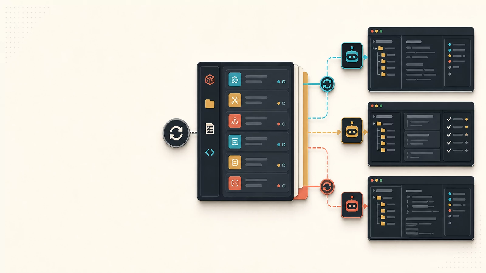
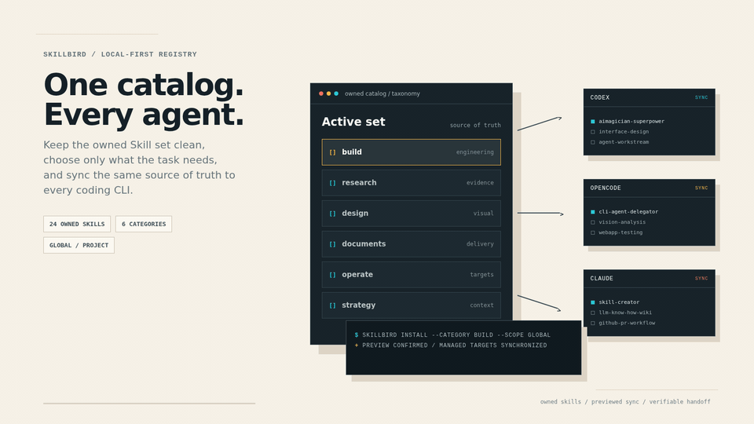

<h1 align="center">Skillbird</h1>

<p align="center">
  <em>Owned skills, rules, and memory that turn AI coding CLIs into evidence-driven engineering and design agents</em>
</p>

<p align="center">
  <a href="https://www.npmjs.com/package/aimagician_superpower"></a>
  <a href="./LICENSE"></a>
  <a href="https://nodejs.org/"></a>
  
</p>

<p align="center">
  <b><a href="#quick-start">Quick Start</a></b> ·
  <b><a href="#workflow">Workflow</a></b> ·
  <b><a href="#skill-consolidation">Skill Consolidation</a></b> ·
  <b><a href="#cli">CLI</a></b> ·
  <b><a href="#architecture">Architecture</a></b>
</p>

<p align="center">
  
</p>

<p align="center">
  
</p>

<p align="center"><a href="./docs/assets/skillbird-readme-demo.html">Open the reproducible demo source</a></p>

---

## What It Is

`aimagician_superpower` is the consolidated home for my AI-agent workflow skills. It encodes senior engineering and design procedures as progressive modules, templates, executable decision rules, and verification gates so quality depends less on a model's unstated experience.

The daily command is `skillbird`. It manages skills across Codex, Claude, OpenCode, Gemini, Hermes, Cursor, and Copilot with global or project-local installs.

The important change: owned skills, always-on rules, and memory policy are now the source of truth. External collections such as GSD, Superpowers, selected Claude skills, UI packs, and Playwright skills are curated into owned skills or kept as disabled reference material. Bootstrap installs only the active owned skill set by default. Later agents should start from [`docs/RULES-AND-MEMORY.md`](docs/RULES-AND-MEMORY.md). Rule and memory sync to CLI targets lands in a later Skillbird engine slice.

## Quick Start

```bash
npm install -g aimagician_superpower
skillbird
```

Use without installing:

```bash
npx aimagician_superpower@latest
```

Install the core workflow stack globally:

```bash
skillbird install aimagician-superpower skill-creator --scope global
```

Install a whole category into a project:

```bash
skillbird install --category documents --scope project --target claude
```

## Workflow

Skillbird keeps a goal-first, risk-scaled workflow model:

1. Classify the request into `Quick`, `Standard`, or `High` by scope, risk, and impact.
2. For `Quick`/`Standard` work, lock the target, acceptance signal, file scope, and decisive verification without heavy planning overhead.
3. For `High`, phase, or milestone work, recover context and lock the active milestone, phase, roadmap goal, requirements, and success criteria.
4. Discuss requirements only when ambiguity materially changes scope, risk, or acceptance; research when local evidence affects the design.
5. Execute surgically, run the decisive verification command, and create or update the PR once the target behavior is proven.
6. Delegate bounded discovery, research, verification, or independent review to the current host's native subagent when it materially saves context or improves confidence.
7. Run independent host-native audits for `High` work, phase/milestone closure, deployable postmerge evidence, or when explicitly requested.
8. Close the task after the verified deliverable is merged or ready; perform Linear/wiki/report updates afterwards only when a ticket, project policy, or user request makes them useful.

The workflow stays light by default for reversible one- or two-file edits, docs, and configuration work. Public APIs, schema/data changes, security, integrations, UI/AI contracts, production state, cross-module work, and multi-Agent execution escalate to the formal `SPEC.md` / independent review path.

The installed skill includes a dependency-free runtime:

```bash
node scripts/workflow.mjs status --project <path> --phase <phase>
node scripts/workflow.mjs planning --project <path> --action status
node scripts/workflow.mjs planning --project <path> --action init --mode local-private --write
node scripts/workflow.mjs planning --project <worktree> --action attach --write
node scripts/workflow.mjs validate --project <path> --phase <phase> --gate align
node scripts/workflow.mjs validate --project <path> --phase <phase> --gate spec
node scripts/workflow.mjs validate --project <path> --phase <phase> --gate execute
node scripts/workflow.mjs validate --project <path> --phase <phase> --gate premerge
node scripts/workflow.mjs validate --project <path> --phase <phase> --gate postmerge
node scripts/workflow.mjs trace --project <path> --phase <phase> --format json
node scripts/workflow.mjs next --project <path> --phase <phase>
node scripts/workflow.mjs init --project <path> --task <task-id> --write
node scripts/workflow.mjs validate --project <path> --task <task-id> --gate align
node scripts/workflow.mjs validate --project <path> --task <task-id> --gate premerge
node scripts/workflow.mjs validate --project <path> --task <task-id> --gate postmerge
node scripts/workflow.mjs validate --project <path> --task <task-id> --gate complete
node scripts/workflow.mjs init --project <path> --milestone <milestone-id> --write
node scripts/workflow.mjs validate --project <path> --milestone <milestone-id> --gate complete
```

For phase-managed or High work, the `align` gate prevents work from drifting away from the active milestone, phase, literal roadmap goal, and requirements. Its `execute` gate adds research, discussion, full-chain context, requirement-mapped plans, and explicit plan acceptance. Use `premerge` and `postmerge` only where deployment evidence is part of the accepted delivery contract. Quick and Standard work use a compact behavior contract, focused verification, and the repository's actual merge protections rather than generating planning artifacts.

Planning can remain tracked or use one local-private store shared by every worktree under the repository's Git common directory. The runtime attaches worktrees, excludes `/.planning` through Git's local exclude file, and provides short write leases with revision conflict detection. Local-private planning has no automatic backup and is lost with the clone.

Lightweight work may use a concise PR description and verification evidence; phase and milestone work use `.planning/tasks/<task-id>.md` plus requirement and `GOAL-*` evidence. High, phase, milestone, deployable-postmerge, policy-required, or explicitly requested closure gets a frozen independent host-native review point and a main-Agent spot-check. Visual evidence is read with the current model's native image tool when available; `vision-analysis` is the fallback when the session cannot see pixels or the user asks for an Agnes evidence package. Planning-managed projects use `.planning/PROJECT.md` and `.planning/CONTEXT.md` for durable product, architecture, invariant, decision, verification, and source-routing continuity. User and project memory live at `~/.skillbird/memory/` and `.planning/memory/`. `init` previews project, phase, task, or milestone artifacts and writes only with `--write`; it never overwrites existing files or follows an unapproved planning symlink outside the project. Condition-based waiting and filesystem pollution isolation are available through `wait-for.mjs` and `find-polluter.mjs`.

Linear is managed only through `composio-tool-router` and Composio CLI, never through Linear MCP. If Linear context is not needed to understand the requirement, a host-native worker may perform the approved post-merge status/comment/closure work as a bounded task after core delivery. The first PR in a project resolves its integration branch from project evidence; no global `dev` default is assumed.

Owned always-on rules live under `rules/owned/` (`code-guidelines`, `review-before-edit`, `native-capability-first`, `host-native-delegation`, `git-safety`, `memory-pointer`). Memory policy and templates live under `memory/owned/project-memory-policy/`. The layout, locked decisions, and leftover engine work are recorded in [`docs/RULES-AND-MEMORY.md`](docs/RULES-AND-MEMORY.md).

The archived OpenCode runner remains available for explicit foreign-CLI work:

```bash
node skills/archived/cli-agent-delegator/scripts/opencode-run.mjs \
  --dir <project> \
  --task-type audit \
  --modality text \
  --model <best-suitable-free-audit-model> \
  --prompt-file <audit-prompt-file> \
  --review-ref <exact-commit>
```

Engineering work also has a deterministic advisor for codebase analysis, progressive discovery, bounded prototypes, feature delivery, root-cause repair, refactoring, performance, and architecture changes:

```bash
node skills/owned/aimagician-superpower/scripts/engineering-route.mjs --kind feature --risk medium --format json
```

The route selects the required context map, design record, vertical slices, test seams, migration strategy, review axes, and completion evidence. Detailed integration decisions are recorded in [`docs/superpowers/mattpocock-engineering-capability-merge.md`](docs/superpowers/mattpocock-engineering-capability-merge.md).

The combined trigger, capability, boundary, and real-project validation is recorded in [`docs/audits/skill-capability-audit-2026-07-21.md`](docs/audits/skill-capability-audit-2026-07-21.md).

The former default OpenCode runner, its permission and model-routing contract, and the migration evidence are historical. They live with the archived skill and [`docs/audits/cli-agent-delegator-upgrade-2026-07-22.md`](docs/audits/cli-agent-delegator-upgrade-2026-07-22.md). Current dispatch is host-native; see [`docs/RULES-AND-MEMORY.md`](docs/RULES-AND-MEMORY.md).

Local-first delivery gates, shared private planning, frozen review points, and Skillbird content-drift validation are recorded in [`docs/audits/local-first-delivery-and-planning-storage-2026-07-30.md`](docs/audits/local-first-delivery-and-planning-storage-2026-07-30.md).

## Core Runtime Skills

| Skill | Role |
|---|---|
| `aimagician-superpower` | Risk-scaled SDD plus project memory, codebase exploration, progressive discovery, prototypes, engineering design, vertical delivery, root-cause debugging, technical review, traceable verification, audit, and handoff |
| `agent-workstream-orchestrator` | Host-native tracked multi-session and multi-lane coordination with optional worktrees, integration ownership, and resumable handoff |
| `vision-analysis` | Fallback Agnes image understanding when the current model cannot see pixels, or when the user asks for a sanitized evidence package |
| `interface-design` | HTML/CSS/JS design, prototypes, UI, dashboards, repository branding, covers, posters, product demo video, creative coding, data visualization, HTML presentations, responsive browser QA, and brand routing |
| `github-readme-highstar` | README information architecture, quick-start clarity, repository visual collaboration, static hero and supplemental demo integration |
| `system-prompt-engineering` | System-prompt requirements, composition, identity, tools, delegation, safety, memory, search, channel adaptation, code-agent behavior, and evaluation |

## Maintainer And On-Demand Skills

These stay installed and searchable, but are not default companions for ordinary application work.

| Skill group | Skills | Trigger |
|---|---|---|
| Skill-system maintenance | `skill-creator`, `skill-optimizer` | Creating, merging, auditing, or measuring an owned Skill |
| Evidence synthesis | `knowledge-distillation`, `perspective-distillation` | Building reusable evidence-backed methods or perspectives |
| Specialist research | `academic-paper-workflow`, `repo-interview-playbook`, `opensource-architecture-research` | Academic publication work, interview artifacts, or explicit architecture comparison |
| Environment operations | `gcloud-ops-workflow` | Accepted Google Cloud evidence or guarded GCP operations |

## Skill Consolidation

External sources are curated into owned skills instead of installed by default.

| Source area | New owned path |
|---|---|
| GSD + Superpowers planning/execution | `aimagician-superpower` plus owned coding rules |
| Host-native subagent dispatch and coding discipline | `rules/owned` |
| User and project memory policy | `memory/owned/project-memory-policy` |
| Direct authorized image understanding and sanitized visual evidence | `vision-analysis` |
| Composio SaaS tool routing and MCP-light discovery | `composio-tool-router` |
| System-prompt playbooks and cross-product prompt patterns | `system-prompt-engineering` |
| Claude skill creator + Superpowers skill writing | `skill-creator` |
| Validation-gated Skill evaluation and iterative improvement | `skill-optimizer` |
| Long-form method extraction and executable knowledge construction | `knowledge-distillation` |
| Person/topic evidence research and perspective construction | `perspective-distillation` |
| frontend-design, design-md brand routing, UI/UX, prototypes, dashboards, data visualization, HTML presentations, accessibility, motion, design-lab, impeccable | `interface-design` |
| Claude webapp-testing + Playwright skill | `webapp-testing` |
| docx / pdf / xlsx plus advanced editable PowerPoint | Owned document skills under `skills/owned` |

Six categories are used everywhere:

| Category | Scope |
|---|---|
| `build` | Coding, planning, debugging, tests, reviews, skill authoring, integrations |
| `research` | Papers, literature, open-source architecture, repo evidence, direct visual evidence |
| `design` | HTML visual design, prototypes, UI/UX, dashboards, data visualization, HTML presentations, brand routing, accessibility, motion, image generation |
| `documents` | README, Word, PDF, PowerPoint, spreadsheets |
| `operate` | GitHub, cloud, tracked host-native workstreams, releases, Composio tool routing |
| `strategy` | Product, business, pricing, customers, growth |

Every owned skill is formatted with `category`, `subcategory`, and `tags` frontmatter:

```bash
skillbird format-skills --check
skillbird format-skills --write
```

### HTML And PowerPoint Boundary

`interface-design` owns browser-native visual work and rendered visual assets: apps, prototypes, landing pages, dashboards, interactive reports, repository covers, autoplay GIF heroes, posters, product showcases, deterministic demo video, creative coding, data visualization, narrated motion, and HTML slides. A standard single-file slide player provides arrow/Page/Space, wheel and touch navigation, `Escape`/`O` overview cards, `F` full screen, progress, URL hash, persisted position, and print behavior. `github-readme-highstar` owns the surrounding README structure and integration.

Native editable `.pptx`, slide masters, Office compatibility, and PowerPoint QA remain owned by `pptx-studio`. When a user explicitly requires HTML as the presentation source, `interface-design` also owns HTML-first PDF and PPTX derivatives. HTML-first PPTX has two explicit modes: native editable DOM-to-PowerPoint objects, or visually faithful image-backed slides. The agent must select editability versus fidelity before implementation.

The HTML design skill includes layout, component, and 40-direction pattern libraries; content-to-pattern decision rules; three-direction comparison and live tweak scaffolds; device frames; browser Deck, PDF, editable/fidelity PPTX, GIF/MP4/alpha overlays, provider-neutral narration, audio mixing, semantic motion-review packages, and visual-quality workflows; plus a deterministic Playwright/ffmpeg renderer, optional project render adapters, and a read-only router:

```bash
node skills/owned/interface-design/scripts/design-router.mjs --task dashboard --deliverable html --signals trends,comparison --format json
node skills/owned/interface-design/scripts/design-router.mjs --task readme-cover --deliverable image --signals developer-tool,terminal --format json
node skills/owned/interface-design/scripts/design-router.mjs --task product-demo --deliverable video --signals workflow,motion --format json
node skills/owned/interface-design/scripts/design-router.mjs --task product-demo --deliverable gif --signals workflow,motion --format json
node skills/owned/interface-design/scripts/design-router.mjs --task html-presentation --deliverable pptx --pipeline html-first --pptx-mode editable --format json
node skills/owned/interface-design/scripts/render-motion-media.mjs --input demo.html --output-dir assets --name demo --formats poster,mp4,gif
node skills/owned/interface-design/scripts/export-html-deck-pptx.mjs --slides slides --out deck.pptx --mode editable
node skills/owned/interface-design/scripts/export-html-stage-pptx.mjs --html deck.html --out deck.pptx --mode fidelity
```

The owned catalog currently contains 23 active Skills plus owned rules and memory policy. Runtime packages contain only capability instructions, references, templates, and helpers; evaluation corpora live under `quality/skill-evals/` and are not installed. Full upstream source mirrors used during consolidation stay ignored under each Skill's `references/_external_repos/`; they are neither packaged nor installed. Project-specific preferences and resumable memory live under `.planning/memory/` and `~/.skillbird/memory/`, outside general-purpose Skills. The distillation, optimization, HTML presentation, README visual, and Skillbird validation records are kept under `docs/audits/`.

See [`docs/design/html-universal-design-capability-merge.md`](docs/design/html-universal-design-capability-merge.md) for the capability analysis and boundary decisions.

## CLI

| Command | Description |
|---|---|
| `skillbird` | Open the TUI dashboard |
| `skillbird search <query>` | Search skills |
| `skillbird search --category build` | Search by category |
| `skillbird install <id> --scope global` | Install selected skills |
| `skillbird install --category documents --scope project` | Install a category bundle |
| `skillbird uninstall <id> --scope global` | Remove managed installs |
| `skillbird list --scope global` | List detected target installs |
| `skillbird inspect --scope project` | Inspect target paths and manifest state |
| `skillbird doctor --scope global` | Detect missing installs and content drift from managed sources |
| `skillbird reset --target claude --scope project --install-all --yes` | Rebuild a target scope |
| `skillbird bootstrap` | Legacy all-selected bootstrap workflow |
| `skillbird --agent capabilities` | Return the versioned Agent command contract |

`install` is additive: installing one skill or selected bundle preserves other managed skills. Use `bootstrap` or `reset` when the target should be reconciled to the full active owner-skill set. Bootstrap also removes unowned Skill directories from selected targets; Codex's `.system` directory is reserved for Codex-managed built-ins and is never removed.

Bootstrap manifests record each managed source path and deterministic content digest. `doctor` compares the current source with Codex, OpenCode, and other managed destinations, so an existing but stale or manually modified Skill is reported as `content drift` instead of healthy.

### Agent Mode

`--agent` is the non-interactive contract for coding agents and automation. It emits ANSI-free, versioned JSON with `schemaVersion`, command, status, mode, data, warnings, errors, and recommended next actions.

```bash
# Discover the contract without running preflight probes.
skillbird --agent capabilities

# Read operations execute immediately.
skillbird --agent list --scope global --target codex
skillbird --agent doctor --scope global --target opencode

# Write operations preview by default.
skillbird --agent install aimagician-superpower --scope global --target codex

# Apply the reviewed preview explicitly.
skillbird --agent install aimagician-superpower --scope global --target codex --yes
```

Agent exit codes are stable: `0` for success, preview, or idempotent state; `1` for execution or health-check failure; `2` for invalid usage; and `3` for partial completion. `--yes` and `--dry-run` cannot be combined in Agent mode. Human CLI and TUI behavior remains available without `--agent`.

Useful flags:

```bash
--target claude                 # repeatable single target
--targets codex,claude,cursor   # comma-separated targets
--scope global|project          # user-level or project-local install
--category build                # category selector
--subcategory browser-testing   # subcategory selector
--tag verification              # tag selector
--include-archived              # include archived skills
--json                          # machine-readable output
--agent                         # stable Agent JSON; writes preview unless paired with --yes
```

## Architecture

```text
skills/
  owned/<skill-id>/SKILL.md      23 active owned skills, default install set
  archived/                      archived local skills (not installed by default)
rules/
  owned/<id>/RULE.md             always-on generic habits; not skills
memory/
  owned/project-memory-policy/   memory read/write policy and templates
catalog/
  taxonomy.yaml                  six-category classification
  skills/*.yaml                  disabled external references
src/
  cli/                           skillbird command surface
  manager/                       search/install/format workflows
  bootstrap/                     target resolution and sync engine
docs/
  RULES-AND-MEMORY.md            current rules, memory, and leftover engine work
```

State paths:

| Scope | Path |
|---|---|
| Global config | `~/.config/skillbird/global/config.yaml` |
| Global state | `~/.local/state/aimagician-superpower/manifest.json` |
| Project config | `<project>/.skillbird/config.yaml` |
| Project state | `<project>/.skillbird/manifest.json` |

## Development

```bash
npm install
npm run build
npm test
```

Run from source:

```bash
node dist/cli/index.js --help
node dist/cli/index.js search --category build
```

## License

MIT — see [LICENSE](./LICENSE).
