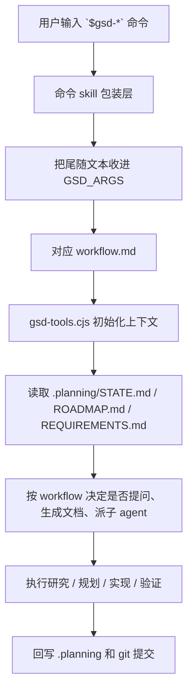
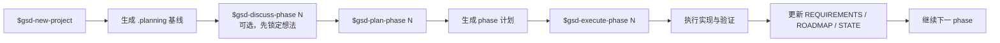
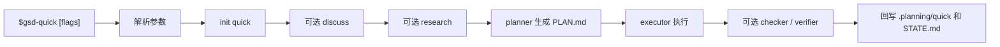
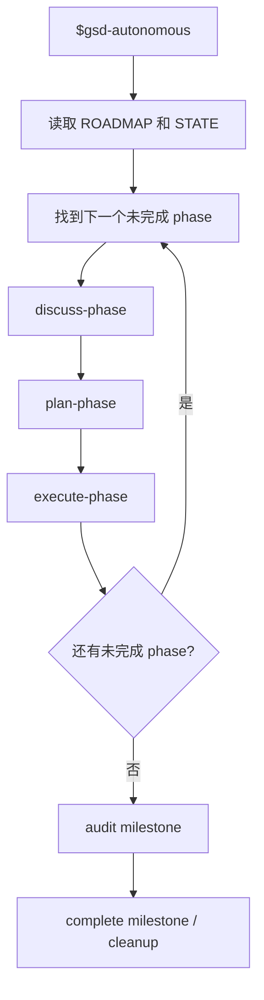
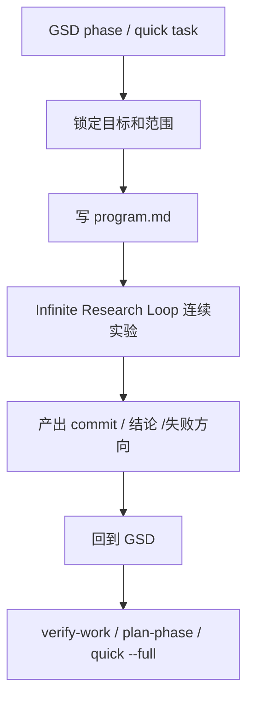

# GSD 设计理念与工作流

本文用来解释 GSD 是什么、为什么命令可以带参数、它有哪些核心工作流，以及在这个 `skills` 项目里应该怎么理解它。

## 什么是 GSD

GSD 是 `Get Shit Done` 的缩写。

它不是单个命令，也不是单个脚本，而是一套面向 agent 开发的项目推进系统：

- 用 `.planning/` 目录保存项目状态
- 用 markdown workflow 定义每一步怎么做
- 用不同类型的 agent 分别做研究、规划、执行、验证
- 用一组 `$gsd-*` 命令当成统一入口

它的核心目标不是“让 agent 直接开干”，而是把项目推进过程变成一个可恢复、可审计、可分阶段执行的状态机。

## 设计理念

GSD 的设计重点有 5 个：

1. 外置状态，而不是只靠上下文记忆
   项目进度、需求、路线图、当前 phase、已完成事项，都会落到 `.planning/` 文件里。

2. 规划和执行分离
   先明确阶段目标，再拆计划，再执行，而不是让 agent 一次性边想边改到最后。

3. 默认支持长周期项目
   会话断掉、模型上下文重置、第二天继续做，都可以从 `.planning/STATE.md` 恢复。

4. 把质量 gate 变成显式步骤
   讨论、研究、plan check、verification、UAT 都是独立流程，不是临时想起来才补。

5. 允许不同强度的模式
   复杂任务走完整 phase 生命周期，小任务走 `quick`，都复用同一套底层机制。

## 为什么 GSD 命令可以带参数

GSD 的参数机制，本质上不是传统 CLI parser 的复杂子命令系统，而是两层结构：

1. `$gsd-xxx` 这个 skill 命令先把命令后面的文本接住
2. 具体 workflow 再去解析这些文本

也就是：

```text
$gsd-plan-phase 2 --prd docs/spec.md
```

会先变成：

```text
command = gsd-plan-phase
args = "2 --prd docs/spec.md"
```

然后 workflow 再从这串 `args` 里拆出：

- phase number: `2`
- flag: `--prd`
- value: `docs/spec.md`

所以它“能带参数”，是因为每个 GSD 命令本身就是一个 skill 包装层，包装层会把尾随文本传给 workflow。

## GSD 的执行模型

可以把 GSD 理解成这一层层往下走：



这也是它和普通脚本的最大区别：

- 普通脚本通常直接执行逻辑
- GSD 先构建上下文，再驱动流程

## 核心文件结构

一个典型 GSD 项目，最重要的是这些文件：

```text
.planning/
  PROJECT.md
  REQUIREMENTS.md
  ROADMAP.md
  STATE.md
  config.json
  phases/
  quick/
  research/
```

各自作用：

- `PROJECT.md`
  记录项目目标、范围、定位
- `REQUIREMENTS.md`
  记录需求和 REQ-ID
- `ROADMAP.md`
  把需求映射成 phase
- `STATE.md`
  当前工作记忆，几乎每个 workflow 都会先读它
- `config.json`
  控制 research、plan check、verifier、parallelization 等开关
- `phases/`
  每个 phase 的 CONTEXT、PLAN、SUMMARY、VERIFICATION、UAT 等产物
- `quick/`
  快速任务模式的产物

## 标准主流程

这是最常见的项目主线：



适合：

- 从 0 到 1 的项目
- 需要阶段化推进的功能开发
- 希望保留完整规划和验收轨迹的仓库

## Quick 模式流程

`quick` 是 GSD 里最实用的轻量模式之一。它不是完整 milestone 流程，而是“同一套系统的短路径”。



常见参数：

- `--discuss`
  先做轻量讨论，把灰区锁进 `CONTEXT.md`
- `--research`
  先做聚焦研究
- `--full`
  增加 plan-check 和 verification

所以这类命令是完全合理的：

```bash
$gsd-quick --discuss --research --full 修复多平台 bootstrap 逻辑
```

它表达的是：

- 做一个 quick task
- 先讨论
- 再研究
- 再走完整版质量 gate
- 最后的任务描述是“修复多平台 bootstrap 逻辑”

## Autonomous 模式流程

如果你不想一 phase 一 phase 手动敲命令，可以走 autonomous：



适合：

- 你已经接受“持续自动推进”
- 任务边界已经比较清晰
- 不想每步都人工中断

## 常见命令应该怎么理解

最常用的一组命令可以这样记：

- `$gsd-new-project`
  初始化项目，把 `.planning/` 骨架建起来
- `$gsd-map-codebase`
  先扫描现有仓库，为 brownfield 项目建立上下文
- `$gsd-discuss-phase 1`
  在 planning 前把你脑子里的预期先锁住
- `$gsd-plan-phase 1`
  把 phase 目标拆成真正可执行的 PLAN
- `$gsd-execute-phase 1`
  执行这个 phase，必要时并行派 agent
- `$gsd-verify-work`
  做面向用户视角的验证和 UAT
- `$gsd-quick ...`
  走轻量短流程
- `$gsd-progress`
  看现在推进到哪里、下一步应该干什么
- `$gsd-resume-work`
  从上次中断的位置恢复
- `$gsd-complete-milestone 1.0.0`
  做版本归档

## 在这个 `skills` 项目里怎么理解 GSD

这个仓库本身就是一个很典型的 GSD 适用场景：

- 有明确的 milestone 和 phase
- 既有实现代码，也有文档、验证、配置
- 需要长期维护，不是一次性脚本

你前面做过的事情，本质上就是这条主线：

```text
new-project
-> requirements / roadmap
-> plan phase
-> execute phase
-> verification
-> 持续补 catalog / skill / docs
```

而你后来新增的 `infinite-research-loop` skill，我已经把它改成了和 GSD 串联的语义：

- GSD 是外层控制面
- `infinite-research-loop` 是内层实验执行器

也就是：



这也是为什么它们能很好串起来：

- GSD 负责整体节奏、状态、验收
- research loop 负责局部高频试验

## 什么时候用 phase，什么时候用 quick

一个简单判断：

- 影响 roadmap 和阶段目标
  用 `phase`
- 只是一个临时但需要质量保证的小任务
  用 `quick`
- 只是想连续做实验、自动找更优结果
  用 `infinite-research-loop`
- 想让整个剩余 roadmap 自动往下跑
  用 `autonomous`

## 一句话总结

GSD 的本质不是“很多命令”，而是：

> 用显式状态文件 + markdown workflow + 子 agent 编排，把长期项目开发变成可恢复、可验证、可分阶段推进的系统。

命令能带参数，是因为参数本来就是传给 workflow 的运行输入，而不是只传给 shell。
